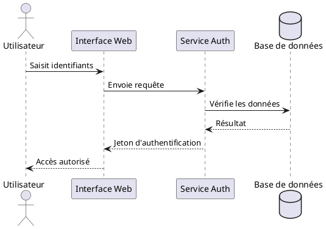
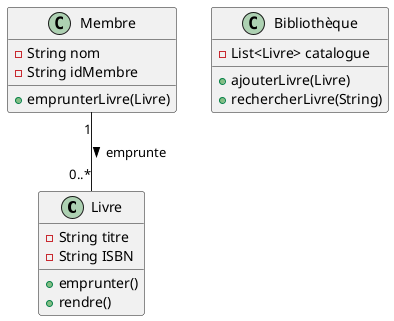
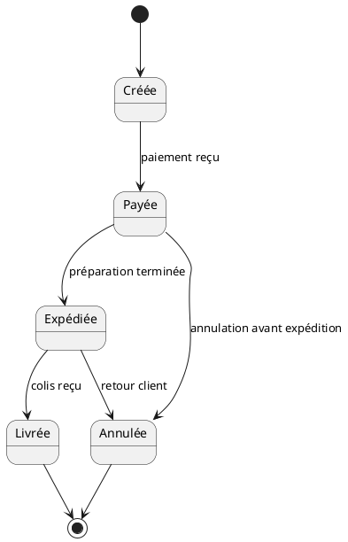
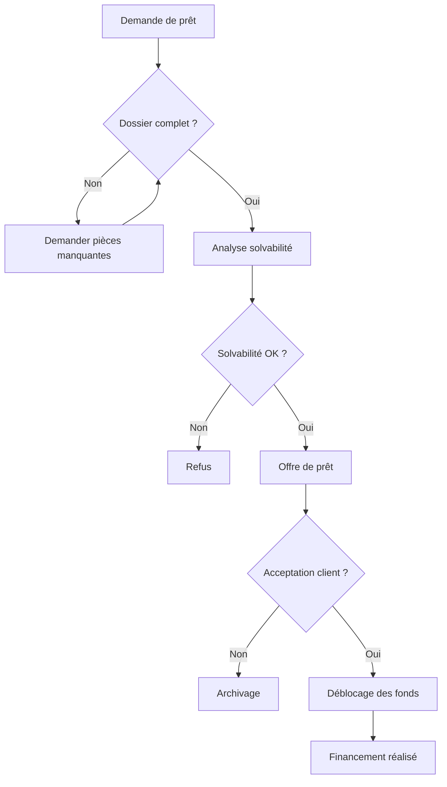
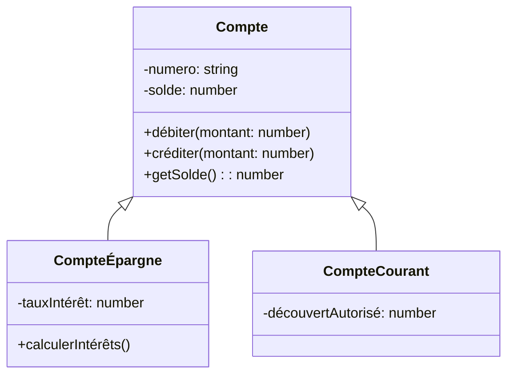
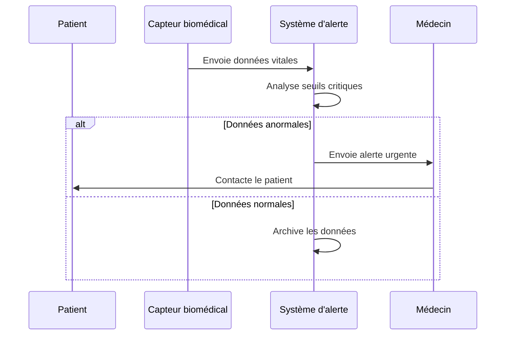
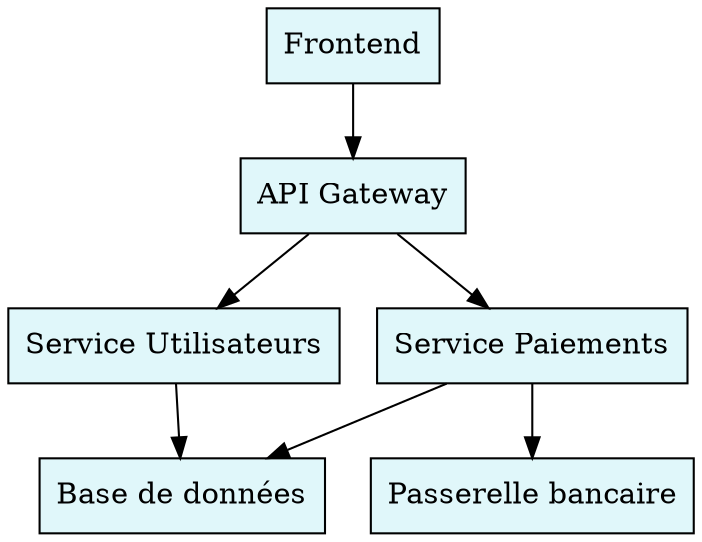
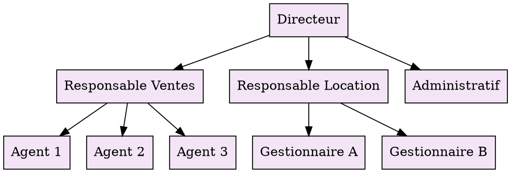
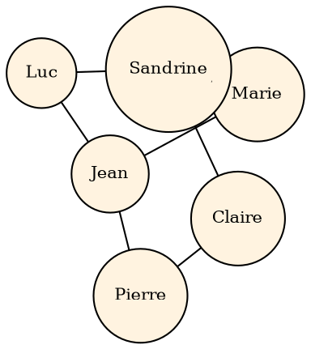

Bien sûr ! Voici un document Markdown complet contenant **3 diagrammes PlantUML**, **3 diagrammes Mermaid** et **3 diagrammes Graphviz**, soigneusement structuré et prêt à être utilisé.

# Collection de diagrammes – Exemples complets

Ce document présente **neuf diagrammes** répartis en trois familles :
- **3 diagrammes PlantUML**
- **3 diagrammes Mermaid**
- **3 diagrammes Graphviz**

---

## 🌿 Diagrammes PlantUML

### 1. Diagramme de séquence – Authentification utilisateur

### 2. Diagramme de classes – Système de gestion de bibliothèque

### 3. Diagramme d’états – Cycle de vie d’une commande

---

## 🌊 Diagrammes Mermaid

### 1. Flowchart – Processus de validation de prêt immobilier

### 2. Diagramme de classes – Modèle de compte bancaire

### 3. Diagramme de séquence – Notification d’alerte médicale

---

## 🔗 Diagrammes Graphviz (DOT)

### 1. Graphe orienté – Dépendances logicielles

### 2. Arbre organisationnel – Structure d’une agence immobilière

### 3. Graphe non orienté – Réseau de contacts professionnels

---

> ✅ **Conseils d’utilisation** :
> - **PlantUML** : Utilise un serveur PlantUML (en ligne ou local) ou un plugin IDE.
> - **Mermaid** : Compatible avec Obsidian, Typora, GitLab, et via `<script>` dans HTML.
> - **Graphviz** : Compile avec la commande `dot -Tpng fichier.dot -o sortie.png`.

Ce document est **autonome** et couvre une variété de cas d’usage (technique, organisationnel, médical, immobilier, etc.). Tu peux l’adapter selon tes besoins spécifiques (par exemple, intégrer des noms réels comme *Sandrine* ou des étapes liées à ton projet immobilier à Juan-les-Pins si nécessaire).

Souhaites-tu une version PDF ou des images exportées de ces diagrammes ?