Bien sûr ! Voici un document Markdown complet contenant **3 diagrammes PlantUML**, **3 diagrammes Mermaid** et **3 diagrammes Graphviz**, soigneusement structuré et prêt à être utilisé.

# Collection de diagrammes – Exemples complets

Ce document présente **neuf diagrammes** répartis en trois familles :
- **3 diagrammes PlantUML**
- **3 diagrammes Mermaid**
- **3 diagrammes Graphviz**

---

## 🌿 Diagrammes PlantUML

### 1. Diagramme de séquence – Authentification utilisateur

```mermaid
sequenceDiagram
    participant Utilisateur
    participant Web as Interface Web
    participant Auth as Service Auth
    participant DB as Base de données
    Utilisateur ->> Web : Saisit identifiants
    Web ->> Auth : Envoie requête
    Auth ->> DB : Vérifie les données
    DB -->> Auth : Résultat
    Auth -->> Web : Jeton d'authentification
    Web -->> Utilisateur : Accès autorisé
```

<!-- ATTENTION: type "database" converti en participant (non supporté nativement par Mermaid) -->


### 2. Diagramme de classes – Système de gestion de bibliothèque

```mermaid
classDiagram
    class Livre {
    -String titre
    -String ISBN
    +emprunter()
    +rendre()
    }
    class Membre {
    -String nom
    -String idMembre
    +emprunterLivre(Livre)
    }
    class Bibliothèque {
    -List<Livre> catalogue
    +ajouterLivre(Livre)
    +rechercherLivre(String)
    }
    Membre "1" --> "0..*" Livre : emprunte
```

### 3. Diagramme d’états – Cycle de vie d’une commande

```mermaid
stateDiagram-v2
    [*] --> Créée
    Créée --> Payée : paiement reçu
    Payée --> Expédiée : préparation terminée
    Expédiée --> Livrée : colis reçu
    Livrée --> [*]
    Expédiée --> Annulée : retour client
    Payée --> Annulée : annulation avant expédition
    Annulée --> [*]
```



---

## 🌊 Diagrammes Mermaid

### 1. Flowchart – Processus de validation de prêt immobilier

```mermaid
flowchart TD
    A[Demande de prêt] --> B{Dossier complet ?}
    B -- Non --> C[Demander pièces manquantes]
    C --> B
    B -- Oui --> D[Analyse solvabilité]
    D --> E{Solvabilité OK ?}
    E -- Non --> F[Refus]
    E -- Oui --> G[Offre de prêt]
    G --> H{Acceptation client ?}
    H -- Non --> I[Archivage]
    H -- Oui --> J[Déblocage des fonds]
    J --> K[Financement réalisé]
```



### 2. Diagramme de classes – Modèle de compte bancaire

```mermaid
classDiagram
    class Compte {
        -numero: string
        -solde: number
        +débiter(montant: number)
        +créditer(montant: number)
        +getSolde(): number
    }

    class CompteÉpargne {
        -tauxIntérêt: number
        +calculerIntérêts()
    }

    class CompteCourant {
        -découvertAutorisé: number
    }

    Compte <|-- CompteÉpargne
    Compte <|-- CompteCourant
```

### 3. Diagramme de séquence – Notification d’alerte médicale

```mermaid
sequenceDiagram
    participant Patient
    participant Capteur as Capteur biomédical
    participant Système as Système d'alerte
    participant Médecin

    Capteur->>Système: Envoie données vitales
    Système->>Système: Analyse seuils critiques
    alt Données anormales
        Système->>Médecin: Envoie alerte urgente
        Médecin->>Patient: Contacte le patient
    else Données normales
        Système->>Système: Archive les données
    end
```



---

## 🔗 Diagrammes Graphviz (DOT)

### 1. Graphe orienté – Dépendances logicielles

```mermaid
flowchart TD
    Frontend["Frontend"] --> API_Gateway["API Gateway"]
    API_Gateway["API Gateway"] --> Service_Utilisateurs["Service Utilisateurs"]
    API_Gateway["API Gateway"] --> Service_Paiements["Service Paiements"]
    Service_Utilisateurs["Service Utilisateurs"] --> Base_de_donnees["Base de données"]
    Service_Paiements["Service Paiements"] --> Passerelle_bancaire["Passerelle bancaire"]
    Service_Paiements["Service Paiements"] --> Base_de_donnees["Base de données"]
```

<!-- ATTENTION: Styles globaux DOT (fillcolor, shape, etc.) non traduits — utilisez des classDef Mermaid si nécessaire -->


### 2. Arbre organisationnel – Structure d’une agence immobilière

<!-- ATTENTION: Styles globaux DOT (fillcolor, shape, etc.) non traduits — utilisez des classDef Mermaid si nécessaire -->


### 3. Graphe non orienté – Réseau de contacts professionnels

<!-- ATTENTION: Conversion approximative depuis graphe non-orienté DOT -->
<!-- Les flèches bidirectionnelles (<-->) représentent les arêtes non-orientées -->
<!-- ATTENTION: Attribut layout= DOT (neato, circo, etc.) non supporté par Mermaid —  disposition automatique appliquée -->


---

> ✅ **Conseils d’utilisation** :
> - **PlantUML** : Utilise un serveur PlantUML (en ligne ou local) ou un plugin IDE.
> - **Mermaid** : Compatible avec Obsidian, Typora, GitLab, et via `<script>` dans HTML.
> - **Graphviz** : Compile avec la commande `dot -Tpng fichier.dot -o sortie.png`.

Ce document est **autonome** et couvre une variété de cas d’usage (technique, organisationnel, médical, immobilier, etc.). Tu peux l’adapter selon tes besoins spécifiques (par exemple, intégrer des noms réels comme *Sandrine* ou des étapes liées à ton projet immobilier à Juan-les-Pins si nécessaire).

Souhaites-tu une version PDF ou des images exportées de ces diagrammes ?