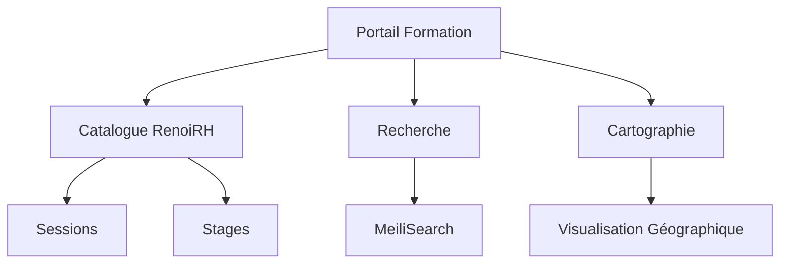
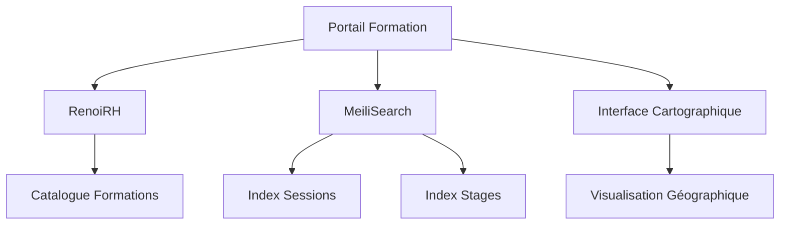
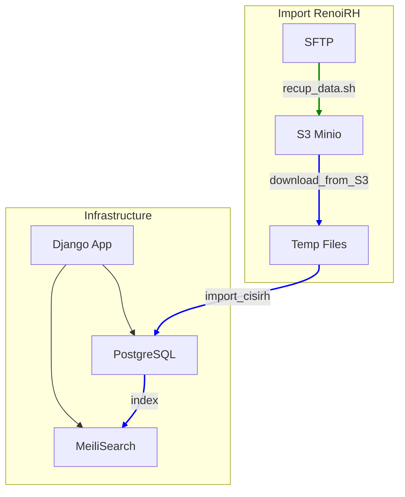
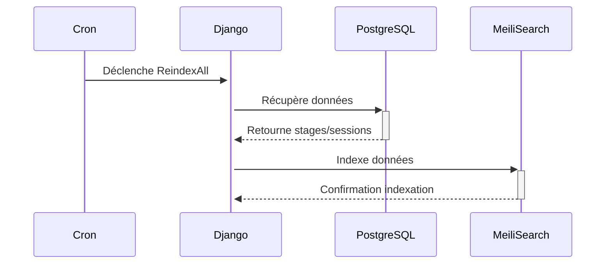
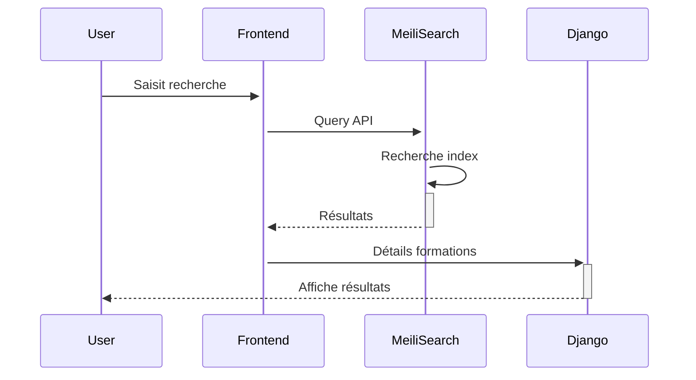
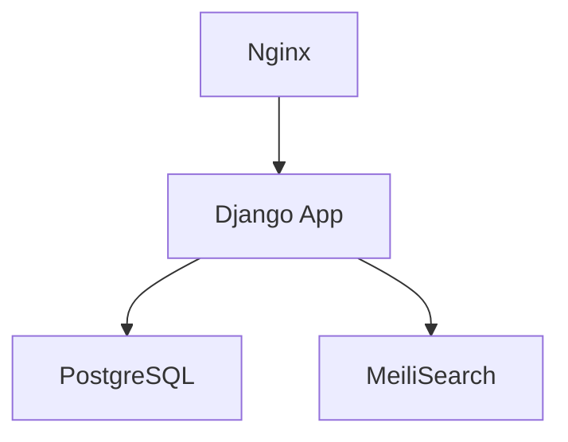

**Document en chantier**

[TOC]

## Introduction et objectifs

### Vue d'ensemble

Le projet est un portail web permettant la consultation et la recherche dans le catalogue RenoiRH des formations. Il offre une exploration cartographique et des fonctionnalités de recherche avancée.

**Fonctionnalités principales:**
- Consultation du catalogue de formations RenoiRH
- Recherche avancée dans le catalogue
- Exploration cartographique des formations
- Visualisation détaillée des sessions de formation



### Objectifs principaux de qualité

1. **Performance de recherche**
   - Temps de réponse < 200ms pour les recherches
   - Pertinence des résultats
   - Interface réactive

2. **Accessibilité**
   - Conformité au RGAA
   - Compatible Design System de l'État
   - Responsive design

3. **Maintenabilité**
   - Code Python/Django structuré
   - Documentation claire
   - Tests automatisés

### Parties prenantes

| Rôle | Contact | Attentes |
|------|---------|----------|
| Utilisateurs ministériels | - | Recherche efficace des formations |
| GTI | gti@xxx.gouv.fr | Maintenance et évolutions |
| Maîtrise d'ouvrage | moa@xxx.gouv.fr | Conformité aux besoins métier |

## Contraintes

### Contraintes d'architecture

- Développement en Python/Django
- Utilisation du Design System de l'État
- Base de données PostgreSQL
- Moteur de recherche MeiliSearch
- Gestion des dépendances avec Poetry
- Python 3.11.7

### Contraintes de sécurité

- **Disponibilité**: Accès au catalogue en continu
- **Intégrité**: Données RenoiRH fiables
- **Confidentialité**: Données publiques uniquement
- **Traçabilité**: Logs applicatifs

## Contexte et périmètre

### Contexte métier



Interfaces fonctionnelles:
- Lecture catalogue RenoiRH
- Moteur de recherche MeiliSearch
- Visualisation cartographique
- Export des données de formation

### Contexte Technique

- Django pour le backend et les vues
- Design System de l'État pour le frontend
- PostgreSQL pour le stockage
- MeiliSearch pour la recherche

## Stratégie de solution

### Modèles de conception

- Architecture monolithique Django (MVT)
- Indexation asynchrone via Crons
- API REST pour les données cartographiques

### Environnement technologique

- Python 3.11.7
- Django dernière version stable
- Poetry pour la gestion des dépendances
- PostgreSQL
- MeiliSearch
- Docker pour le développement
- Design System de l'État (DSFR)

### Forge logicielle - CI/CD

- GitLab pour le versioning et CI/CD
- Tests unitaires Django
- Docker Compose pour le développement
- Makefile pour les commandes courantes

## Vue en Briques


 Cron Import SFTP → S3 (Tous les mardis à samedis à 04h00)

 Cron Import S3 → DB (Tous les mardis à samedis à 04h30)

### Composants principaux

1. **Application Django**
   - **Models**
     - Stage (catalogue formations)
     - Session (instances formations)
     - Période (créneaux formation)
   
   - **Views**
     - Recherche catalogue
     - Visualisation cartographique
     - Filtres et facettes
   
   - **Templates**
     - Design System État (DSFR)
     - Interface responsive
     - Templates accessibles RGAA

2. **MeiliSearch**
   - **Index stages**
     - Titre formation
     - Mots-clés
     - Localisation
   
   - **Index sessions**
     - Dates
     - Lieux
     - Places disponibles

3. **PostgreSQL**
   - **Tables**
     - formations_stage
     - formations_session
     - formations_periode
   
   - **Contraintes**
     - Intégrité référentielle
     - Validations métier

4. **Intégration RenoiRH**
   - **Import SFTP → S3** (4h00)
     ```python
     # VM Sèche: 10.167.71.51
     # filepath: /home/admingti/recup_data.sh
     # Récupération quotidienne (mar-sam)
     # Archive jour précédent
     # Import nouveaux fichiers
     ```
   
   - **Import S3 → DB** (4h30)
     ```python
     # filepath: app/management/commands/import_cisirh.py
     # Parse fichiers CSV
     # Import PostgreSQL
     # Index MeiliSearch
     ```
## Vue Exécution

### Scénario 1: Indexation des données RenoiRH



### Scénario 2: Recherche utilisateur



## Vue Déploiement

### Environnements

| Environnement | Serveur | Usage | URL |
|--------------|-------------|------------|------------|
| Développement | 192.168.5.139 | Tests et validation | http://dev.formation-ecologie.pnm3.eco4.cloud.e2.rie.gouv.fr/ |
| Production | 192.168.5.52 | Production | http://formation-ecologie.e2.rie.gouv.fr/ |

### Infrastructure

Le produit est hébergé sur le cloud interne ECO4 basé sur Openstack, dans le tenant 'pnm3' du département.
Le reverse-proxy Nginx du schéma ci-dessous est en fait une paire de Nginx load-balancés en frontal des produits hébergés sur le tenant.



### Supervision

Le produit est supervisé via le système standard du GTI pour ce faire :

* via Portainer pour la partie purement containérisation,
* via la stack Prometheus/Grafana/Loki/AlertManager,

Le produit dispose également d'une supervision PSIN.

### Sauvegardes

Les sauvegardes de la base de données sont assurées par des scripts standards du GTI permettant la création de dumps cryptés en AES-256 et déposés sur :

* le stockage objet B3 du IaaS ministériel,
* le stockage objet Outscale SecNumCloud (via la prestation qu'a le GTI sur le marché "Nuage Public"),
* le stockage objet standard de Google Cloud (via la prestation qu'a le GTI sur le marché "Nuage Public")

## Sujets transverses

1. **Gestion des données**
   - Import catalogue RenoiRH
   - Indexation MeiliSearch

2. **Monitoring**
   - Logs Django
   - Métriques MeiliSearch
   - Surveillance base de données

3. **Maintenance**
   - Commandes make
   - Crons d'indexation
   - Mises à jour dépendances Poetry

## Exigences de qualité

| Exigence | Validation | Mesure |
|----------|------------|--------|
| Performance recherche | < 200ms | Logs MeiliSearch |
| Conformité DSFR | Audit visuel | Checklist Design System |
| Maintenance | Poetry/Make | Facilité mise à jour |

## Risques et Dettes techniques

1. **Dette**: Documentation indexation
   - Impact: Moyen
   - Solution: Documentation des processus MeiliSearch

## Annexes

### Glossaire

- **RenoiRH**: Système RH source des données
- **DSFR**: Design System de l'État
- **GTI**: Groupe Technique Informatique

### Décisions d'architectures - ADR

- [ADR-001] Choix MeiliSearch vs Elasticsearch