# Règles de Rédaction PlantUML

**Document de référence** : Bonnes pratiques pour écrire des diagrammes PlantUML sans erreurs

**Date de création** : 2026-02-02
**Auteur** : Hervé Marchal <herve.marchal@hotmail.fr>
**Version** : 1.0

---

## Table des Matières

1. [Principes Généraux](#principes-generaux)
2. [Rectangles et Composants](#rectangles-et-composants)
3. [Diagrammes d'Objets](#diagrammes-objets)
4. [Diagrammes d'Activité](#diagrammes-activite)
5. [Notes et Documentation](#notes-et-documentation)
6. [Commentaires et Symboles](#commentaires-symboles)
7. [Mindmaps](#mindmaps)
8. [Compatibilité Slinky vs Graphviz](#compatibilite)
9. [Checklist de Validation](#checklist)

---

<a name="principes-generaux"></a>
## 1. Principes Généraux

### ✅ Règle #1 : Privilégier la Complexité

**TOUJOURS préférer les structures complexes aux structures simples.**

#### ❌ Mauvais exemple (simplicité + notes)

```text
rectangle "Level 1" as level1

note right of level1
  <b>Level 2</b>
  • Item 1
  • Item 2

  <b>Level 3</b>
  • Détail 1
  • Détail 2
end note
```

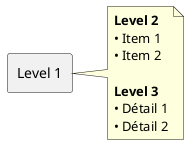
**Pourquoi** : L'utilisation de notes peut masquer la structure réelle du diagramme et le rendre moins détaillé.

#### ✅ Bon exemple (structure complexe)

```text
rectangle "Level 1" {
  rectangle "Level 2" {
    rectangle "Level 3" {
      - Item 1
      - Item 2
    }
  }
}
```

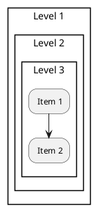
**Pourquoi** : Les structures imbriquées reflètent mieux la complexité du système.

---

### ✅ Règle #2 : Mettre l'alias avant la couleur

**L'alias doit être défini AVANT la couleur pour éviter les erreurs de référence.**

#### ❌ Mauvais exemple (couleur avant alias)

```text
rectangle "1. Arguments CLI" #FF6B6B as cli

note bottom of cli
  <b>Priorité MAXIMALE</b>
  Contenu de la note
end note
```

```plantuml
@startuml
rectangle "1. Arguments CLI" #FF6B6B as cli

note bottom of cli
  <b>Priorité MAXIMALE</b>
  Contenu de la note
end note
@enduml
```
**Pourquoi** : Mettre la couleur (#FF6B6B) AVANT l'alias (as cli) peut causer des problèmes de parsing. L'alias risque de ne pas être reconnu correctement.

#### ✅ Bon exemple (alias avant couleur)

```text
rectangle "1. Arguments CLI" as cli #FF6B6B

note bottom of cli
  <b>Priorité MAXIMALE</b>
  Contenu de la note
end note
```

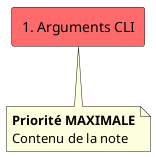

**Pourquoi** : L'ordre correct est : `nom as alias #couleur`. L'alias vient immédiatement après le nom, puis la couleur.

#### 🔧 Comment corriger

**Transformation** : `rectangle "Nom" #COULEUR as alias` → `rectangle "Nom" as alias #COULEUR`

1. Placer `as alias` juste après le nom de l'élément
2. Placer la couleur `#COULEUR` en dernier
3. Ordre correct : **nom → alias → couleur**

---

### ✅ Règle #3 : Éviter les Caractères Spéciaux dans les Noms

**Liste des caractères à éviter dans les identifiants** :
- `:` (deux-points) - interprété comme séparateur de stéréotype
- `\n` (newline) - cause des erreurs de référence
- `*` (astérisque) - conflit avec le markdown PlantUML
- `**` (double astérisque) - conflit avec le bold dans mindmaps

#### ❌ Mauvais exemple

```text
object "feat:" {
  Impact = MINOR
}
```

```plantuml
@startuml
object "feat:" {
  Impact = MINOR
}
@enduml
```
**Pourquoi** : L'utilisation de `:` dans le nom de l'objet est interprétée comme un séparateur de stéréotype et peut causer des erreurs.

#### ✅ Bon exemple

```text
object feat {
  Type = "feat:"
  Impact = MINOR
}
```

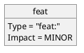
**Pourquoi** : Le nom de l'objet est un identifiant simple, et le type est défini comme un attribut, ce qui est la syntaxe correcte.

---

<a name="rectangles-et-composants"></a>
## 2. Rectangles et Composants

### ✅ Règle #5 : Utiliser les Listes à Tirets dans les Rectangles Imbriqués

**TOUJOURS privilégier les listes à tirets dans les rectangles imbriqués pour une meilleure lisibilité.**

#### ❌ Mauvais exemple (utiliser des notes)

```text
rectangle "Container" #LIGHTBLUE as container

note right of container
  <b>Actions:</b>
  • Action 1
  • Action 2
  • Action 3
end note
```

```plantuml
@startuml
rectangle "Container" #LIGHTBLUE as container

note right of container
  <b>Actions:</b>
  • Action 1
  • Action 2
  • Action 3
end note
@enduml
```
**Pourquoi** : L'utilisation de notes pour de courtes listes peut être verbeuse et moins directe.

#### ✅ Bon exemple

```text
rectangle "Container" {
  rectangle "Actions" {
    - Action 1
    - Action 2
    - Action 3
  }
}
```

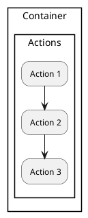
**Pourquoi** : C'est une syntaxe plus compacte et lisible pour les listes simples.

---

### ✅ Règle #6 : Mettre la couleur après l'alias

#### ❌ Mauvais exemple

```text
rectangle "Config" {
  config/piag.yaml:
    timeout: 120
    retries: 3
}
```

```plantuml
@startuml
rectangle "Config" #LIGHTYELLOW as config {
  config/piag.yaml:
    timeout: 120
    retries: 3
}
@enduml
```
**Pourquoi** : L'indentation YAML/JSON à l'intérieur du rectangle est mal interprétée par PlantUML. Le contenu ne s'affiche pas comme prévu.

#### ✅ Bon exemple (utiliser des notes)

```text
rectangle "Config" #LIGHTYELLOW as config

note right of config
  <b>config/piag.yaml:</b>
  timeout: 120
  retries: 3
end note
```

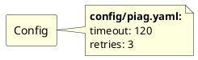
**Pourquoi** : Les notes préservent le formatage du texte pré-formaté et sont le conteneur approprié pour des extraits de code ou de configuration.

#### 🔧 Comment corriger

**Transformation** : Contenu indenté dans rectangle → Note avec contenu pré-formaté

1. Créer un rectangle simple avec un alias : `rectangle "Config" as config`
2. Ajouter une couleur pour distinguer : `#LIGHTYELLOW`
3. Créer une note attachée : `note right of config`
4. Mettre le contenu YAML/JSON dans la note (l'indentation est préservée)
5. Utiliser `<b>...</b>` pour les titres dans la note
6. Fermer avec `end note`

---

<a name="diagrammes-objets"></a>
## 3. Diagrammes d'Objets

_Note : Les bonnes pratiques de style pour les objets PlantUML sont documentées dans le guide des guidelines Claude._

---

<a name="diagrammes-activite"></a>
## 4. Diagrammes d'Activité

### ✅ Règle #9 : `backward` Uniquement dans `repeat...repeat while`

**NE JAMAIS utiliser `backward` en dehors d'une structure `repeat`.**

#### ❌ Mauvais exemple (backward sans repeat)

```text
if (Validation OK ?) then (✅ oui)
  :Continuer;
else (❌ non)
  :Corriger;
  backward :Re-tester;  # ❌ ERREUR
endif
```

```plantuml
@startuml
if (Validation OK ?) then (✅ oui)
  :Continuer;
else (❌ non)
  :Corriger;
  backward :Re-tester;  # ❌ ERREUR
endif
```
**Pourquoi** : `backward` est un mot-clé réservé pour les boucles `repeat`.

#### ✅ Bon exemple (repeat...repeat while)

```text
repeat
  :Tests & validation;

  if (Validation OK ?) then (oui)
  else (non)
    :Corriger;
    :Rebuild;
  endif

repeat while (Validation OK ?) is (non) not (oui)
```

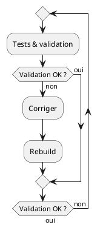
**Pourquoi** : La structure `repeat...repeat while` est la manière correcte d'implémenter des boucles qui peuvent nécessiter de revenir en arrière.

---


<a name="notes-et-documentation"></a>
## 5. Notes et Documentation

### ✅ Règle #12 : Utiliser `<b>` pour le Bold dans les Notes

**Utiliser les balises HTML pour le formatage dans les notes.**

```text
note right of element
  <b>Titre en Gras</b>
  <i>Texte en italique</i>
  <u>Texte souligné</u>

  Texte normal
end note
```

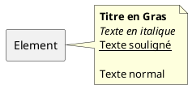

**Balises supportées** :
- `<b>texte</b>` - gras
- `<i>texte</i>` - italique
- `<u>texte</u>` - souligné
- `<color:red>texte</color>` - couleur

---

### ✅ Règle #13 : Échapper les Caractères Spéciaux dans les Notes

**Utiliser `<` et `>` pour les chevrons dans les notes.**

```text
note right of element
  Format: <source>2<dest>

  Fichiers:
  - commands/<name>.py
  - core/<name>_converter.py
end note
```

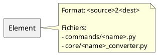

---

<a name="commentaires-symboles"></a>
## 6. Commentaires et Symboles

### ✅ Règle #19 : Utiliser les Commentaires Correctement

**Utiliser les commentaires PlantUML pour documenter le code du diagramme.**

```text
' Commentaire sur une seule ligne (apostrophe)

/'
  Ceci est un commentaire
  sur plusieurs lignes.
  Il explique une section complexe du diagramme.
'/

actor Utilisateur
participant Système

Utilisateur -> Système : Fait une requête ' Description de la requête
```

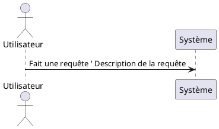

**Pourquoi** : Les commentaires aident à la compréhension et à la maintenance des diagrammes, surtout pour les sections complexes ou les choix de conception.

---

### ✅ Règle #20 : Éviter les Caractères Spéciaux non Supportés

**Éviter l'utilisation de symboles qui peuvent être interprétés comme des éléments PlantUML.**

#### ❌ Mauvais exemple (peut causer des problèmes de parsing)

```text
rectangle "Ma Fonction => Resultat" {
  -- Option 1 --
}
```

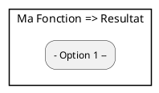
**Pourquoi** : Certains symboles (comme `=>`, `--`, `->`) ont une signification spéciale en PlantUML et peuvent perturber le parsing s'ils sont utilisés hors de leur contexte.

#### ✅ Bon exemple (Utiliser des noms descriptifs sans symboles spéciaux ou notes)

```text
rectangle "Ma Fonction et son Résultat" as funcResult

note bottom of funcResult
  Option 1 : Description
end note
```

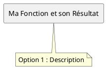
**Pourquoi** : En évitant les symboles réservés, on garantit que le diagramme sera parsé correctement.

---

### ✅ Règle #21 : Balises @startuml et @enduml Obligatoires

**TOUJOURS encadrer les diagrammes PlantUML avec les balises `@startuml` et `@enduml`.**

#### ❌ Mauvais exemple (sans balises)

```text
rectangle "Element" as elem

note right of elem
  Description
end note
```

**Pourquoi** : Sans ces balises, PlantUML ne peut pas identifier le début et la fin du diagramme. Le code ne sera pas converti en image.

#### ✅ Bon exemple (avec balises)

```text
@startuml
rectangle "Element" as elem

note right of elem
  Description
end note
@enduml
```

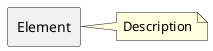

**Pourquoi** : Les balises `@startuml` et `@enduml` délimitent le code PlantUML et permettent sa conversion en SVG/image.

**Note importante** : Dans un fichier Markdown, ces balises doivent être à l'intérieur du bloc ` ```plantuml ` :

```markdown
\```plantuml
@startuml
rectangle "Test"
@enduml
\```
```

---

### ✅ Règle #22 : Toujours Fermer avec @enduml

**TOUJOURS terminer un diagramme PlantUML par `@enduml`, sinon le diagramme ne sera pas converti.**

#### ❌ Mauvais exemple (oubli de @enduml)

```text
@startuml
object nomObjet
nomObjet : attribut1 = valeur1
nomObjet : attribut2 = valeur2
```

**Erreur** : Le diagramme n'est jamais fermé. PlantUML ne sait pas où se termine le code.

#### ✅ Bon exemple (avec @enduml)

```text
@startuml
object nomObjet
nomObjet : attribut1 = valeur1
nomObjet : attribut2 = valeur2
@enduml
```

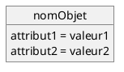

**Pourquoi** : `@enduml` ferme le bloc PlantUML et indique que le diagramme est complet. Sans cette balise, le rendu échoue.

#### 🔧 Comment corriger

**Symptôme** : Diagramme non converti en image, code source affiché tel quel

**Solution** :
1. Vérifier que chaque `@startuml` a son `@enduml` correspondant
2. Placer `@enduml` à la fin du code PlantUML, juste avant ` ``` `
3. Ne PAS oublier le `@` devant `enduml`

**Pattern correct** :
```
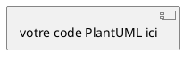
```

---

### ✅ Règle #23 : Rectangles avec Accolades Non Vides

**Les rectangles avec accolades `{ }` doivent contenir au moins une ligne (même vide).**

#### ❌ Mauvais exemple (rectangle vide)

```text
rectangle "Mon Element" as elem #LIGHTBLUE {
}
```

```plantuml
@startuml
rectangle "Mon Element" as elem #LIGHTBLUE {
}
@enduml
```

**Erreur** : Le rectangle avec accolades est complètement vide. PlantUML peut mal interpréter cette syntaxe et produire un rendu incorrect.

#### ✅ Bon exemple (avec au moins une ligne)

**Option 1** : Ajouter une ligne vide à l'intérieur
```text
rectangle "Mon Element" as elem #LIGHTBLUE {

}
```

```plantuml
@startuml
rectangle "Mon Element" as elem #LIGHTBLUE {

}
@enduml
```

**Option 2** : Ajouter du contenu
```text
rectangle "Mon Element" as elem #LIGHTBLUE {
  - Item 1
  - Item 2
}
```

```plantuml
@startuml
rectangle "Mon Element" as elem #LIGHTBLUE {
  - Item 1
  - Item 2
}
@enduml
```

**Option 3** : Utiliser un rectangle sans accolades
```text
rectangle "Mon Element" as elem #LIGHTBLUE
```

```plantuml
@startuml
rectangle "Mon Element" as elem #LIGHTBLUE
@enduml
```

**Pourquoi** : Les accolades vides `{ }` peuvent causer des problèmes de parsing. Si le rectangle n'a pas de contenu, soit ajouter une ligne vide, soit ne pas utiliser d'accolades.

#### 🔧 Comment corriger

**Transformation** : `rectangle "Nom" { }` → `rectangle "Nom" { <ligne vide> }` ou `rectangle "Nom"`

1. Si le rectangle doit rester vide : ajouter une ligne vide entre les accolades
2. Si possible : ajouter du contenu (liste, texte)
3. Alternative : supprimer les accolades si pas de contenu

**Pattern recommandé** :
- Avec contenu : `rectangle "Nom" { - Item }`
- Sans contenu : `rectangle "Nom"` (pas d'accolades)
- Vide temporaire : `rectangle "Nom" { <espace> }`

---

### ✅ Règle #24 : Utiliser @startmindmap pour les Mindmaps

**Les mindmaps doivent utiliser `@startmindmap`/`@endmindmap`, PAS `@startuml`/`@enduml`.**

#### ❌ Mauvais exemple (utilise @startuml)

```text
@startuml
@startmindmap
* Racine
** Branche 1
*** Sous-branche
@endmindmap
@enduml
```

```plantuml
@startuml
@startmindmap
* Racine
** Branche 1
*** Sous-branche
@endmindmap
@enduml
```

**Erreur** : Utiliser `@startuml` avec `@startmindmap` est redondant et incorrect. Les mindmaps ont leurs propres balises.

#### ✅ Bon exemple (utilise @startmindmap)

```text
@startmindmap
* Racine
** Branche 1
*** Sous-branche 1.1
*** Sous-branche 1.2
** Branche 2
@endmindmap
```

```plantuml
@startmindmap
* Racine
** Branche 1
*** Sous-branche 1.1
*** Sous-branche 1.2
** Branche 2
@endmindmap
```

**Pourquoi** : Les mindmaps sont un type spécial de diagramme PlantUML qui utilise sa propre syntaxe de délimitation.

#### 🔧 Comment corriger

**Transformation** :
```
❌ @startuml              ✅ @startmindmap
   @startmindmap             * Racine
   * Racine                  ** Branche
   @endmindmap               @endmindmap
   @enduml
```

**Solution** :
1. Remplacer `@startuml` par `@startmindmap` au début
2. Remplacer `@enduml` par `@endmindmap` à la fin
3. Supprimer `@startmindmap` et `@endmindmap` internes si présents

**Pattern correct pour mindmap** :
```
@startmindmap
* Nœud racine
** Niveau 1
*** Niveau 2
@endmindmap
```

**Pattern incorrect** :
```
@startuml
@startmindmap
...
@endmindmap
@enduml
```

---

### ✅ Règle #25 : Pas d'Emojis dans les Labels

**Ne PAS utiliser d'emojis (✅, ❌, etc.) dans les labels de diagrammes d'activité (`is`, `then`, `else`).**

#### ❌ Mauvais exemple (emojis dans labels)

```text
if (Validation OK ?) then (✅ oui)
  :Continuer;
else (❌ non)
  :Corriger;
endif
```

```plantuml
@startuml
if (Validation OK ?) then (✅ oui)
  :Continuer;
else (❌ non)
  :Corriger;
endif
@enduml
```

**Erreur** : Les emojis/icônes (✅, ❌, 🚀, etc.) dans les labels peuvent causer des problèmes d'encodage et de rendu selon l'environnement PlantUML.

#### ✅ Bon exemple (texte simple)

```text
if (Validation OK ?) then (oui)
  :Continuer;
else (non)
  :Corriger;
endif
```

```plantuml
@startuml
if (Validation OK ?) then (oui)
  :Continuer;
else (non)
  :Corriger;
endif
@enduml
```

**Pourquoi** : Les labels textuels simples garantissent un rendu cohérent sur tous les environnements (terminal, PDF, HTML, etc.).

#### 🔧 Comment corriger

**Transformation** : Retirer les emojis des labels `is`, `then`, `else`, `not`

**Exemples de corrections** :
- `is (✅ oui)` → `is (oui)`
- `is (❌ non)` → `is (non)`
- `then (✅ succès)` → `then (succès)`
- `else (❌ échec)` → `else (échec)`

**Note** : Les emojis restent acceptables dans :
- Les titres (`title 🚀 Mon Diagramme`)
- Le contenu des notes
- Le texte des rectangles
- Les noms d'éléments (mais déconseillé)

**Zones à éviter pour les emojis** :
- Labels `is (...)`, `then (...)`, `else (...)`, `not (...)`
- Labels de boucles `repeat while (...)`
- Identifiants d'alias

---

<a name="mindmaps"></a>
## 7. Mindmaps

### ✅ Règle #16 : Respecter la Hiérarchie des Mindmaps

**Structure hiérarchique stricte** :
- `*` - Nœud racine (1 seul)
- `**` - Niveau 1 (enfants de la racine)
- `***` - Niveau 2 (petits-enfants)
- `****` - Niveau 3 (arrière-petits-enfants)

```text
@startmindmap
* Racine
** Branche 1
*** Sous-branche 1.1
*** Sous-branche 1.2
** Branche 2
*** Sous-branche 2.1
@endmindmap
```

```plantuml
@startmindmap
* Racine
** Branche 1
*** Sous-branche 1.1
*** Sous-branche 1.2
** Branche 2
*** Sous-branche 2.1
@endmindmap
```

---

<a name="compatibilite"></a>
## 8. Compatibilité Slinky vs Graphviz

### Comprendre les Deux Moteurs de Rendu PlantUML

**PlantUML utilise deux moteurs de rendu** :

1. **Slinky (moteur natif Java)** - Pas besoin de Graphviz
   - Activity diagrams
   - Sequence diagrams
   - State diagrams
   - Object diagrams simples
   - Mindmaps
   - Rectangles avec flèches simples

2. **Graphviz (moteur externe)** - Nécessite installation de Graphviz
   - Class diagrams avec relations
   - Component diagrams avec imbrication
   - Package diagrams
   - Deployment diagrams

---

### ✅ Règle #18 : Privilégier les Diagrammes Compatibles Slinky

**Pour une portabilité maximale, utiliser les types de diagrammes qui fonctionnent sans Graphviz.**

**Diagrammes recommandés (Slinky)** :
- Activity diagrams pour les workflows
- Sequence diagrams pour les interactions
- Rectangles simples pour les architectures
- Object diagrams pour les données
- Mindmaps pour les concepts

**Diagrammes à éviter (Graphviz requis)** :
- Class diagrams avec relations `-->`
- Component diagrams avec imbrication
- Package diagrams

---

<a name="documentation"></a>
## 9. Documentation et Formatage Markdown

### ✅ Règle #26 : Identifier Chaque Diagramme (Sans Balises HTML Complexes)

**Au-delà du code PlantUML lui-même, dans le document Markdown contenant les diagrammes, chaque diagramme doit être identifié de manière simple et portable.**

**IMPORTANT** : **Éviter les balises `<figure markdown>` et `</figure>`** qui causent des problèmes de compatibilité entre les convertisseurs Markdown.

#### ✅ Bon exemple (identification simple et portable)

```markdown
Comme illustré à la **Figure 1.1**, l'architecture repose sur trois couches principales.

```plantuml
@startuml
!theme aws-orange

package "Couche Présentation" {
  [Frontend React]
}

package "Couche Services" {
  [Auth Service]
}

[Frontend React] --> [Auth Service] : HTTPS / JSON
@enduml
```
<figcaption>Figure 1.1 – Architecture globale à trois couches</figcaption>

> ℹ️ *Source : Conception équipe DevOps, février 2026.*
```

**Éléments recommandés** :
1. **Référence dans le texte** : `**Figure X.Y**` mentionnée AVANT le diagramme
2. **Bloc PlantUML** : Directement avec ` ```plantuml ` (sans balise HTML)
3. **Légende** : `<figcaption>Figure X.Y – Description</figcaption>` SOUS le diagramme
4. **Source** (optionnel) : Note informative avec `> ℹ️ *Source: ...*`

#### ❌ Mauvais exemple 1 (diagramme nu sans identification)

```markdown
```plantuml
@startuml
package "Services" {
  [Auth Service]
}
@enduml
```
```

**Problèmes** :
- Pas de référence dans le texte
- Pas de légende
- Impossible de référencer dans le document

#### ❌ Mauvais exemple 2 (utilisation de `<figure markdown>`)

```markdown
<figure markdown>
```plantuml
@startuml
rectangle "Test"
@enduml
```
<figcaption>Figure 1 – Test</figcaption>
</figure>
```

**Problèmes** :
- Balises `<figure markdown>` et `</figure>` causent des problèmes de compatibilité
- Non supporté par tous les convertisseurs Markdown (GitHub, certains parsers)
- Peut casser le rendu lors de conversion MD → HTML → PDF

**Pourquoi éviter `<figure markdown>` ?**
- ❌ Incompatibilité avec GitHub/GitLab Markdown
- ❌ Problèmes avec certains convertisseurs (Pandoc, ambulon)
- ❌ Balises HTML mixées avec Markdown = parsing fragile
- ✅ Approche simple avec `<figcaption>` seul = plus robuste et portable

**Pourquoi identifier les diagrammes ?**
- Référencement croisé dans le document
- Traçabilité et professionnalisme
- Conformité aux standards de documentation technique
- Facilite la maintenance et les mises à jour

---

### ✅ Règle #27 : Éviter les Commentaires qui Cassent le Rendu

**Ne PAS utiliser de commentaires HTML contenant des balises Markdown (` ```markdown `) ou des balises HTML (`<figure>`, `</figure>`) car ils empêchent le rendu correct des diagrammes.**

#### ❌ Mauvais exemples (commentaires problématiques)

**Exemple 1 : Commentaire avec \`\`\`markdown**
```markdown
<!-- EVITER
```markdown
-->
# Mon document

<figure markdown>
```plantuml
@startuml
rectangle "Test"
@enduml
```
</figure>
```

**Problème** : Le ` ```markdown ` dans le commentaire casse le parsing Markdown.

**Exemple 2 : Commentaire avec balises HTML**
```markdown
<!-- EVITER
<figure markdown>
-->
```plantuml
@startuml
rectangle "Test"
@enduml
```
<figcaption>Figure 1 – Test</figcaption>
<!-- EVITER
</figure>
-->
```

**Problème** : Les balises `<figure>` et `</figure>` commentées désynchronisent le parsing HTML.

**Exemple 3 : Commentaire quote avec EVITER**
```markdown
'EVITER <figure markdown>
```plantuml
@startuml
rectangle "Test"
@enduml
```
</figure>
```

**Problème** : Le `'EVITER` avec balise HTML perturbe le rendu.

#### ✅ Bon exemple (commentaires corrects)

```markdown
<!-- Note: Ce diagramme illustre l'architecture -->

<figure markdown>
```plantuml
@startuml
rectangle "Test"
@enduml
```
<figcaption>Figure 1 – Test</figcaption>
</figure>

<!-- TODO: Ajouter une note sur les performances -->
```

**Commentaires acceptables** :
- `<!-- Note simple sans balises Markdown/HTML -->`
- `<!-- TODO: Description de tâche -->`
- `<!-- FIXME: Problème à corriger -->`

**Commentaires à ÉVITER** :
- `<!-- EVITER ` suivi de ` ```markdown `
- `<!-- EVITER <figure> -->`
- `'EVITER <balise-html>`
- Tout commentaire contenant des délimiteurs de code ou balises

**Pourquoi** : Les commentaires avec balises Markdown/HTML perturbent le parsing et causent :
- Non-rendu des diagrammes
- Désynchronisation des balises ouvrantes/fermantes
- Échec de conversion MD → HTML → PDF
- Problèmes d'affichage dans les éditeurs (Obsidian, VSCode)

#### 🔧 Comment corriger

**Transformation** : Supprimer ou simplifier les commentaires problématiques

**Avant** :
```markdown
<!-- EVITER
```markdown
-->
<figure markdown>
```

**Après** :
```markdown
<!-- Exemple de figure avec diagramme -->
<figure markdown>
```

**Ou encore mieux** : Supprimer complètement les commentaires `EVITER` si ce sont des exemples de ce qu'il ne faut pas faire. Dans ce cas, documenter dans une section séparée avec des blocs de code texte.

---

<a name="checklist"></a>
## 10. Checklist de Validation

### Avant de Générer un PDF PlantUML

**Vérifier les points suivants** :

- [ ] **Pas de nesting > 2 niveaux** de rectangles
- [ ] **Pas de listes à tirets** dans des rectangles imbriqués
- [ ] **Pas de YAML/JSON indenté** dans des rectangles
- [ ] **Tous les éléments ont des alias simples** (pas de `\n`, `:`, etc.)
- [ ] **Notes utilisées** pour les contenus complexes
- [ ] **Syntaxe object correcte** : `object nom` puis `nom : attr = val`
- [ ] **Pas de `:` dans les noms** d'objets ou rectangles
- [ ] **`backward` uniquement dans `repeat...repeat while`**

- [ ] **Tous les blocs ont `@startuml` et `@enduml`** (Règle #21, #22)
- [ ] **Rectangles avec braces `{ }` ont au moins une ligne** (Règle #23)
- [ ] **Mindmaps utilisent `@startmindmap`/`@endmindmap`** (Règle #24)
- [ ] **Pas d'emojis dans les labels** `is`, `then`, `else`, `not` (Règle #25)
- [ ] **Diagrammes identifiés avec référence + `<figcaption>`** (Règle #26)
- [ ] **Éviter `<figure markdown>` et `</figure>`** (Règle #26)
- [ ] **Pas de commentaires `<!-- EVITER ` avec balises MD/HTML** (Règle #27)

- [ ] **Pas de `**` dans les mindmaps** (sauf pour hiérarchie)
- [ ] **Class diagrams convertis en rectangles** si pas de Graphviz
- [ ] **Utilisation de `<b>` au lieu de `**`** pour le bold dans les notes
- [ ] **Commentaires utilisés** pour documenter le code du diagramme
- [ ] **Pas de caractères spéciaux non supportés** dans les noms d'éléments (ex: `=>`, `--`, `->`)

